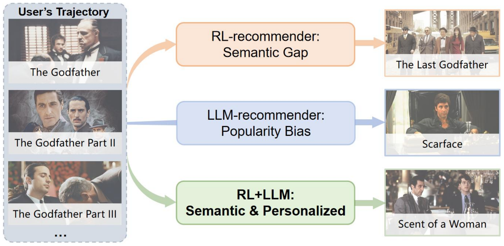

This is the official implementation repository of our paper: Beyond Static LLM Policies: Imitation-Enhanced Reinforcement Learning for Recommendation. Now we introduce the reproduction procedures.





## Preliminaries 

### Environment Setup

Create the conda environment:

```bash
cd /path/to/IL-Rec
conda env create -f environment.yml
conda activate ilrec
```

If you already have a compatible [ROLeR](https://github.com/ArronDZhang/ROLeR) environment, install the Python requirements there:

```bash
pip install -r requirements.txt
```

Full training uses CUDA. The smoke tests and unit tests do not require GPU, LLaMA weights, or the full matrices.


### Required External Artifacts

Large artifacts are intentionally not committed. Put them under the repository root with this layout:

```text
env/
  amazon/
    amazon_train.npy
    amazon_test.npy
    train_distance_mat.pickle
    test_distance_mat.pickle
    amazon_embedding_task.pt
    datamaps.json
  steam/
    steam_train.npy
    steam_test.npy
    train_distance_mat.pickle
    test_distance_mat.pickle
    steam_embedding_task.pt
    datamaps.json

environments/ILRec/data/
  amazon/
    demo_gpt35.pkl
    item.csv
    test.csv
    train.csv
    user.csv
  steam/
    demo_gpt35.pkl
    item.csv
    test.csv
    train.csv
    user.csv
```

The `*_train.npy` and `*_test.npy` files are the precomputed DeepFM `matPre` world-model matrices. The distance matrices are used by the quitting mechanism.
LLaMA weights are external and are passed through `--embedding-model-path`.


### Data Preparation

If `environments/ILRec/data/{amazon,steam}` is not already prepared, build the CSV tables from a local source checkout that contains the original ILRec data and `env/` artifacts:

```bash
python tools/build_ilrec_roler_data.py \
  --dataset amazon \
  --ilrec-root /path/to/source-il-rec \
  --output-root environments/ILRec/data

python tools/build_ilrec_roler_data.py \
  --dataset steam \
  --ilrec-root /path/to/source-il-rec \
  --output-root environments/ILRec/data
```

Build the GPT-3.5 demonstration buffers:

```bash
python tools/build_ilrec_demo_buffer.py \
  --dataset amazon \
  --ilrec-root /path/to/source-il-rec \
  --traj-glob '/path/to/source-il-rec/trajs_agent/amazon_train_*.json' \
  --split train \
  --embedding-fallback \
  --model-path /path/to/llama2-7bhf \
  --output environments/ILRec/data/amazon/demo_gpt35.pkl

python tools/build_ilrec_demo_buffer.py \
  --dataset steam \
  --ilrec-root /path/to/source-il-rec \
  --traj-glob '/path/to/source-il-rec/trajs_agent/steam_train_*.json' \
  --split train \
  --embedding-fallback \
  --model-path /path/to/llama2-7bhf \
  --output environments/ILRec/data/steam/demo_gpt35.pkl
```

Smoke fixtures for tests are included under `environments/ILRec/data_smoke`.


**Note** that the preliminaries can be done following the README.md of [BiLLP](https://github.com/jizhi-zhang/BiLLP).


## Train And Evaluate

### Amazon

```bash
python run_Policy_ILRec.py \
  --env AmazonEnv-v0 \
  --demo-buffer environments/ILRec/data/amazon/demo_gpt35.pkl \
  --ilrec-root . \
  --embedding-model-path /path/to/llama2-7bhf \
  --state-action-cache-path saved_models/AmazonEnv-v0/ILRec/amazon_state_action_embeddings.pt \
  --output-dir saved_models/AmazonEnv-v0/ILRec \
  --summary-json results/ILRec/amazon/standard_100users_fb_summary.json \
  --rollout-json results/ILRec/amazon/standard_100users_fb_rollouts.json \
  --eval-users-json results/ILRec/amazon/standard_100users_userids.json \
  --seed 0 \
  --cuda 0
```

The checkpoint is written under `saved_models/AmazonEnv-v0/ILRec/checkpoints/`.

### Steam

```bash
python run_Policy_ILRec.py \
  --env SteamEnv-v0 \
  --demo-buffer environments/ILRec/data/steam/demo_gpt35.pkl \
  --ilrec-root . \
  --embedding-model-path /path/to/llama2-7bhf \
  --state-action-cache-path saved_models/SteamEnv-v0/ILRec/steam_state_action_embeddings.pt \
  --output-dir saved_models/SteamEnv-v0/ILRec \
  --summary-json results/ILRec/steam/standard_100users_fb_summary.json \
  --rollout-json results/ILRec/steam/standard_100users_fb_rollouts.json \
  --eval-users-json results/ILRec/steam/standard_100users_userids.json \
  --seed 0 \
  --cuda 1
```

The checkpoint is written under `saved_models/SteamEnv-v0/ILRec/checkpoints/`.


## Released Results

Our evaluation setting follows [BiLLP](https://github.com/jizhi-zhang/BiLLP). Since the test setting contains only 100 users, results may vary substantially across random seeds. Although the original five seed sets for each dataset are no longer available, our reproduced results are no worse than those reported in the paper on both the test sets corresponding to the released [BiLLP](https://github.com/jizhi-zhang/BiLLP) result files and five newly sampled seed sets. Reference results are provided below.

The public `results/` tree contains only the final Amazon and Steam outputs:

```text
results/ILRec/amazon/
  standard_100users_userids.json
  standard_100users_fb_summary.json
  standard_100users_fb_rollouts.json
  fb_5seeds_summary.json
  fb_5seeds_summary.csv

results/ILRec/steam/
  standard_100users_userids.json
  standard_100users_fb_summary.json
  standard_100users_fb_rollouts.json
  fb_5seeds_summary.json
  fb_5seeds_summary.csv
```

Current public metrics:

| Dataset | Scope | Avg length | Avg reward | Avg return |
| --- | --- | ---: | ---: | ---: |
| Amazon | standard 100 users, seed 0 | `11.49` | `4.583986074847694` | `52.67` |
| Amazon | 5 seeds | `11.66` | `4.562101797565839` | `53.202` |
| Steam | standard 100 users, seed 0 | `21.27` | `4.592383638928068` | `97.68` |
| Steam | 5 seeds | `20.694` | `4.55440651330688` | `94.27600000000001` |


## Cite

If you find this repo useful, please cite

```tex
@inproceedings{yi2025ilrec,
  author       = {Zhang, Yi and Xie, Lili and Qiu, Ruihong and Liu, Jiajun and Wang, Sen},
  title        = {Beyond Static {LLM} Policies: Imitation-Enhanced Reinforcement Learning
                  for Recommendation},
  booktitle    = {{IEEE} International Conference on Data Mining (ICDM)},
  pages        = {903--912},
  year         = {2025}
}
```


## Acknowledge

Our LLM demonstration is based on BiLLP, whose BibTeX is:

```tex
@inproceedings{shi2024billp,
author = {Shi, Wentao and He, Xiangnan and Zhang, Yang and Gao, Chongming and Li, Xinyue and Zhang, Jizhi and Wang, Qifan and Feng, Fuli},
title = {Large Language Models are Learnable Planners for Long-Term Recommendation},
year = {2024},
booktitle = {Proceedings of the 47th International ACM SIGIR Conference on Research and Development in Information Retrieval (SIGIR)},
pages = {1893–1903},
}
```

Our codebase is based on ROLeR, whose BibTeX is:

```tex
@inproceedings{zhang2024roler,
  title={ROLeR: Effective Reward Shaping in Offline Reinforcement Learning for Recommender Systems},
  author={Zhang, Yi and Qiu, Ruihong and Liu, Jiajun and Wang, Sen},
  booktitle={Proceedings of the 33rd ACM International Conference on Information and Knowledge Management},
  pages={3269--3278},
  year={2024}
}
```

